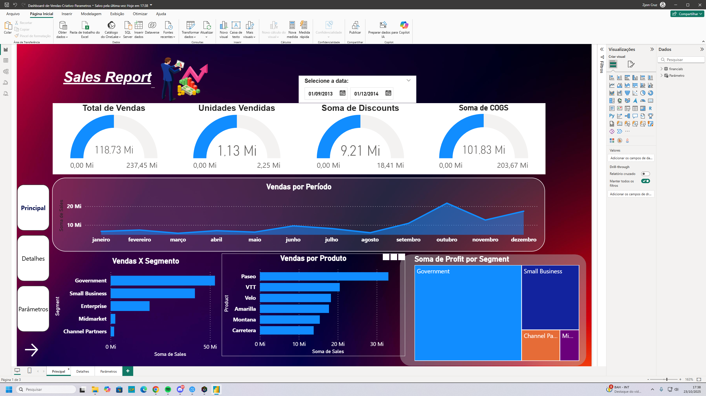
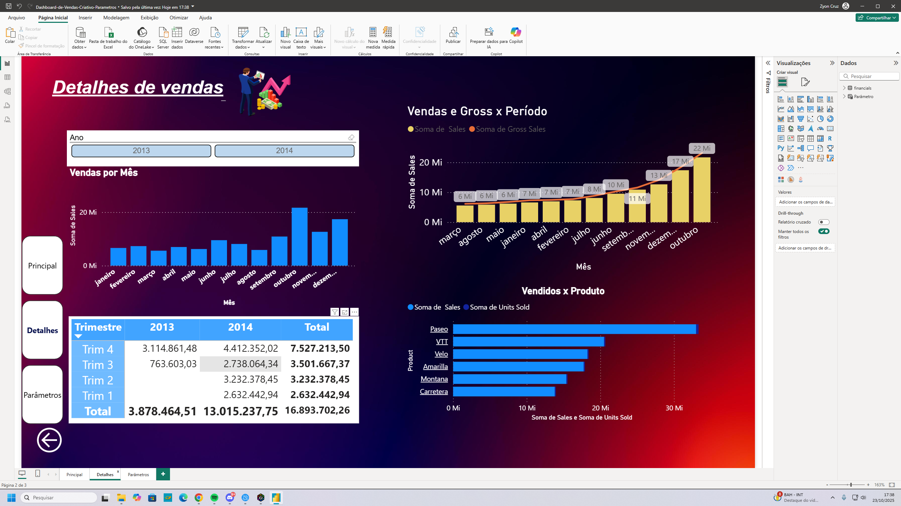
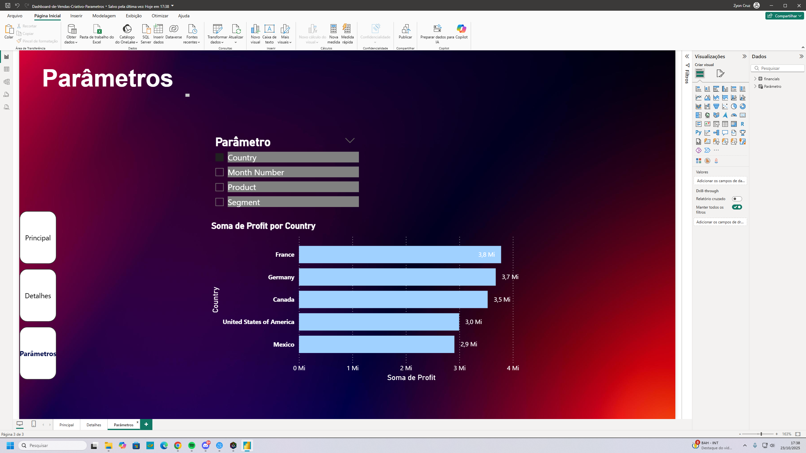

# Dashboard-de-Vendas-com-Par-metros-de-Campo
Dashboard de Vendas Avançado com Parâmetros de Campo
Este repositório contém a solução para um desafio de projeto avançado da DIO, focado em levar um dashboard de BI do design à interatividade analítica, utilizando **Parâmetros de Campo (Field Parameters)**.
Este projeto é uma evolução do dashboard criativo "dark mode", removendo a "Home Page" (capa) para uma abordagem mais direta à análise e adicionando uma poderosa camada de personalização para o usuário.

## 1. Objetivo do Desafio
O objetivo principal foi enriquecer um dashboard existente com uma das funcionalidades mais poderosas do Power BI: **Parâmetros de Campo**. Isso permite que o usuário final altere dinamicamente as dimensões de um visual, tornando o relatório mais flexível e reduzindo a necessidade de criar múltiplas páginas ou gráficos.

## 2. Destaque do Projeto: Parâmetros de Campo
A principal funcionalidade implementada foi a criação de uma nova página "Parâmetros".

1.  **O que é:** Utilizando o recurso "Novo Parâmetro -> Campos" (na aba "Modelagem"), criei um filtro que permite ao usuário escolher qual dimensão de análise ele deseja ver.
2.  **Dimensões Incluídas:** O usuário pode alternar a visualização do gráfico "Soma de Profit" entre:
    * `Country` (País)
    * `Month Number` (Número do Mês)
    * `Product` (Produto)
    * `Segment` (Segmento)
3.  **Benefício:** Em vez de ter 4 gráficos estáticos separados, o usuário tem **um único gráfico dinâmico** que ele mesmo controla, proporcionando uma experiência de análise muito mais rica e personalizada.

## 3. Design (UI/UX) e Navegação
O design "dark mode" profissional do projeto anterior foi mantido e refinado:

* **Tema:** O "dark mode" com fundo gradiente (roxo/vermelho) foi aplicado em todas as páginas para consistência.
* **Cards com Transparência:** Os visuais são organizados sobre "cards" (Formas com cantos arredondados) com fundo semi-transparente, criando um visual moderno.
* **Navegação:** O relatório agora tem 3 páginas de análise (`Principal`, `Detalhes`, `Parâmetros`). A navegação é feita por um menu lateral consistente, construído com **Botões** e **Indicadores (Bookmarks)**, que foi atualizado para incluir a nova página de Parâmetros.

## 4. Screenshots do Relatório Final
### Página 1: Dashboard Principal

### Página 2: Detalhes de Vendas

### Página 3: Página de Parâmetros (com Field Parameters)

